```python
import pandas as pd
df=pd.read_csv('/Users/Florian_Gao/Desktop/git/github/wanmen-python/modol.csv')
```


```python
df
```


<div>
<style scoped>
    .dataframe tbody tr th:only-of-type {
        vertical-align: middle;
    }

    .dataframe tbody tr th {
        vertical-align: top;
    }

    .dataframe thead th {
        text-align: right;
    }
</style>
<table border="1" class="dataframe">
  <thead>
    <tr style="text-align: right;">
      <th></th>
      <th>序号</th>
      <th>姓名</th>
      <th>性别</th>
      <th>语文</th>
      <th>数学</th>
      <th>英语</th>
    </tr>
  </thead>
  <tbody>
    <tr>
      <th>0</th>
      <td>1</td>
      <td>高</td>
      <td>男</td>
      <td>120</td>
      <td>110</td>
      <td>130</td>
    </tr>
    <tr>
      <th>1</th>
      <td>2</td>
      <td>李</td>
      <td>男</td>
      <td>110</td>
      <td>129</td>
      <td>131</td>
    </tr>
    <tr>
      <th>2</th>
      <td>3</td>
      <td>赵</td>
      <td>女</td>
      <td>111</td>
      <td>123</td>
      <td>124</td>
    </tr>
    <tr>
      <th>3</th>
      <td>4</td>
      <td>孙</td>
      <td>女</td>
      <td>124</td>
      <td>145</td>
      <td>143</td>
    </tr>
    <tr>
      <th>4</th>
      <td>5</td>
      <td>兰</td>
      <td>男</td>
      <td>122</td>
      <td>133</td>
      <td>144</td>
    </tr>
  </tbody>
</table>
</div>


```python
df['new_score']=df.apply(lambda x:x.数学+x.语文,axis=1)
df
```


<div>
<style scoped>
    .dataframe tbody tr th:only-of-type {
        vertical-align: middle;
    }

    .dataframe tbody tr th {
        vertical-align: top;
    }

    .dataframe thead th {
        text-align: right;
    }
</style>
<table border="1" class="dataframe">
  <thead>
    <tr style="text-align: right;">
      <th></th>
      <th>序号</th>
      <th>姓名</th>
      <th>性别</th>
      <th>语文</th>
      <th>数学</th>
      <th>英语</th>
      <th>new_score</th>
    </tr>
  </thead>
  <tbody>
    <tr>
      <th>0</th>
      <td>1</td>
      <td>高</td>
      <td>男</td>
      <td>120</td>
      <td>110</td>
      <td>130</td>
      <td>230</td>
    </tr>
    <tr>
      <th>1</th>
      <td>2</td>
      <td>李</td>
      <td>男</td>
      <td>110</td>
      <td>129</td>
      <td>131</td>
      <td>239</td>
    </tr>
    <tr>
      <th>2</th>
      <td>3</td>
      <td>赵</td>
      <td>女</td>
      <td>111</td>
      <td>123</td>
      <td>124</td>
      <td>234</td>
    </tr>
    <tr>
      <th>3</th>
      <td>4</td>
      <td>孙</td>
      <td>女</td>
      <td>124</td>
      <td>145</td>
      <td>143</td>
      <td>269</td>
    </tr>
    <tr>
      <th>4</th>
      <td>5</td>
      <td>兰</td>
      <td>男</td>
      <td>122</td>
      <td>133</td>
      <td>144</td>
      <td>255</td>
    </tr>
  </tbody>
</table>
</div>


```python
df=df.drop(['new_score'],axis=1)

```


```python
df
```


<div>
<style scoped>
    .dataframe tbody tr th:only-of-type {
        vertical-align: middle;
    }

    .dataframe tbody tr th {
        vertical-align: top;
    }

    .dataframe thead th {
        text-align: right;
    }
</style>
<table border="1" class="dataframe">
  <thead>
    <tr style="text-align: right;">
      <th></th>
      <th>序号</th>
      <th>姓名</th>
      <th>性别</th>
      <th>语文</th>
      <th>数学</th>
      <th>英语</th>
    </tr>
  </thead>
  <tbody>
    <tr>
      <th>0</th>
      <td>1</td>
      <td>高</td>
      <td>男</td>
      <td>120</td>
      <td>110</td>
      <td>130</td>
    </tr>
    <tr>
      <th>1</th>
      <td>2</td>
      <td>李</td>
      <td>男</td>
      <td>110</td>
      <td>129</td>
      <td>131</td>
    </tr>
    <tr>
      <th>2</th>
      <td>3</td>
      <td>赵</td>
      <td>女</td>
      <td>111</td>
      <td>123</td>
      <td>124</td>
    </tr>
    <tr>
      <th>3</th>
      <td>4</td>
      <td>孙</td>
      <td>女</td>
      <td>124</td>
      <td>145</td>
      <td>143</td>
    </tr>
    <tr>
      <th>4</th>
      <td>5</td>
      <td>兰</td>
      <td>男</td>
      <td>122</td>
      <td>133</td>
      <td>144</td>
    </tr>
  </tbody>
</table>
</div>


# 绘图


```python
import numpy as np
import pandas as pd
import matplotlib.pyplot as plt
%matplotlib inline  
# 说明要画在notebook中
```


```python
x=np.linspace(0,10,100)
y=np.sin(x)
plt.plot(x,y)
```


    [<matplotlib.lines.Line2D at 0x1a22542cc0>]


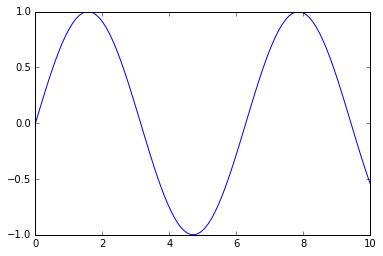


```python
fig=plt.figure()
plt.plot(x,y,'--')
```


    [<matplotlib.lines.Line2D at 0x1a226a2cc0>]


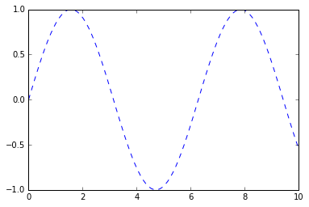


```python
#保存图片，与点击保存效果相同
fig.savefig('/Users/Florian_Gao/Desktop/git/github/wanmen-python/first_plot.png')
```

## 分块


```python
plt.subplot(2,1,1)
plt.plot(x,y,'--',label='sinx')
plt.legend()
plt.subplot(2,1,2)
plt.plot(x,np.cos(x),'--',color='r',label='cosx')
# legend控制label的显示效果
plt.legend()
```


    <matplotlib.legend.Legend at 0x1a22790860>


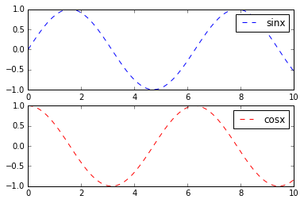


```python
plt.plot?
```


```python
# xlim ylim
plt.xlim(0,1)
```


    (0, 1)


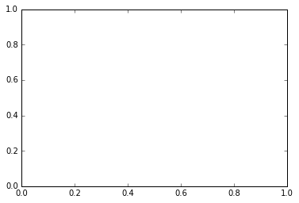


```python
plt.scatter(x,y)  #点状图
```


    <matplotlib.collections.PathCollection at 0x1a22a54860>


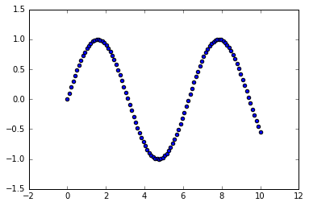


```python
import random
# 改变样式
plt.style.use('classic')

x=np.random.randn(100) #均值0，方差1
y=np.random.randn(100) 
colors=np.random.rand(100)
sizes=1000*np.random.rand(100)
plt.scatter(x,y,c=colors,s=sizes,alpha=0.4)
plt.colorbar()
```


    <matplotlib.colorbar.Colorbar at 0x1a22b649b0>


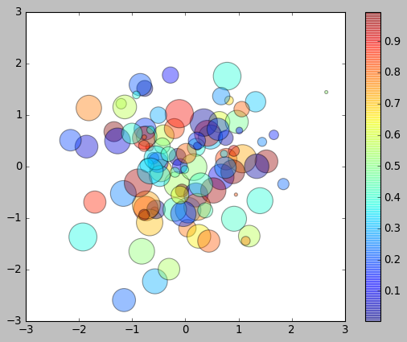


## pandas 本身自带绘画


```python
df=pd.DataFrame(np.random.rand(100,4).cumsum(0),columns=['A','B','C','D'])
#comsum 是加和操作 0 按行/1 按列
df.plot()
df.head()
```


<div>
<style scoped>
    .dataframe tbody tr th:only-of-type {
        vertical-align: middle;
    }

    .dataframe tbody tr th {
        vertical-align: top;
    }

    .dataframe thead th {
        text-align: right;
    }
</style>
<table border="1" class="dataframe">
  <thead>
    <tr style="text-align: right;">
      <th></th>
      <th>A</th>
      <th>B</th>
      <th>C</th>
      <th>D</th>
    </tr>
  </thead>
  <tbody>
    <tr>
      <th>0</th>
      <td>0.289320</td>
      <td>0.372710</td>
      <td>0.051150</td>
      <td>0.019810</td>
    </tr>
    <tr>
      <th>1</th>
      <td>0.870367</td>
      <td>1.203777</td>
      <td>0.615242</td>
      <td>0.735907</td>
    </tr>
    <tr>
      <th>2</th>
      <td>1.275859</td>
      <td>1.596964</td>
      <td>0.738416</td>
      <td>1.724947</td>
    </tr>
    <tr>
      <th>3</th>
      <td>1.688890</td>
      <td>1.935973</td>
      <td>0.902156</td>
      <td>1.758310</td>
    </tr>
    <tr>
      <th>4</th>
      <td>2.499074</td>
      <td>2.698976</td>
      <td>1.019705</td>
      <td>2.375565</td>
    </tr>
  </tbody>
</table>
</div>


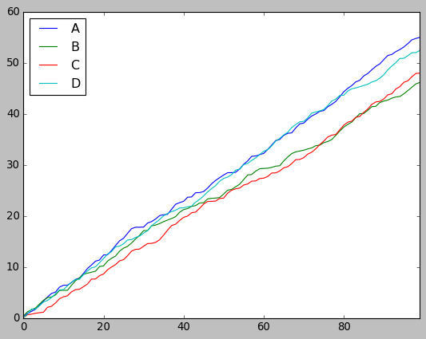


```python
df=pd.DataFrame(np.random.rand(100,4),columns=['A','B','C','D'])
df.plot()
df.head()
```


<div>
<style scoped>
    .dataframe tbody tr th:only-of-type {
        vertical-align: middle;
    }

    .dataframe tbody tr th {
        vertical-align: top;
    }

    .dataframe thead th {
        text-align: right;
    }
</style>
<table border="1" class="dataframe">
  <thead>
    <tr style="text-align: right;">
      <th></th>
      <th>A</th>
      <th>B</th>
      <th>C</th>
      <th>D</th>
    </tr>
  </thead>
  <tbody>
    <tr>
      <th>0</th>
      <td>0.061443</td>
      <td>0.842002</td>
      <td>0.241945</td>
      <td>0.455003</td>
    </tr>
    <tr>
      <th>1</th>
      <td>0.501737</td>
      <td>0.168112</td>
      <td>0.050991</td>
      <td>0.418404</td>
    </tr>
    <tr>
      <th>2</th>
      <td>0.940408</td>
      <td>0.085285</td>
      <td>0.573517</td>
      <td>0.259610</td>
    </tr>
    <tr>
      <th>3</th>
      <td>0.423264</td>
      <td>0.796483</td>
      <td>0.684808</td>
      <td>0.929808</td>
    </tr>
    <tr>
      <th>4</th>
      <td>0.317713</td>
      <td>0.310176</td>
      <td>0.148773</td>
      <td>0.330037</td>
    </tr>
  </tbody>
</table>
</div>


```python
dp=pd.DataFrame(np.random.randint(30,50,(3,4)),columns=['A','B','C','D'],index=['one','two','three'])
dp
```


<div>
<style scoped>
    .dataframe tbody tr th:only-of-type {
        vertical-align: middle;
    }

    .dataframe tbody tr th {
        vertical-align: top;
    }

    .dataframe thead th {
        text-align: right;
    }
</style>
<table border="1" class="dataframe">
  <thead>
    <tr style="text-align: right;">
      <th></th>
      <th>A</th>
      <th>B</th>
      <th>C</th>
      <th>D</th>
    </tr>
  </thead>
  <tbody>
    <tr>
      <th>one</th>
      <td>31</td>
      <td>34</td>
      <td>39</td>
      <td>36</td>
    </tr>
    <tr>
      <th>two</th>
      <td>46</td>
      <td>30</td>
      <td>30</td>
      <td>42</td>
    </tr>
    <tr>
      <th>three</th>
      <td>39</td>
      <td>41</td>
      <td>39</td>
      <td>46</td>
    </tr>
  </tbody>
</table>
</div>


```python
dp.plot.bar()
```


    <matplotlib.axes._subplots.AxesSubplot at 0x1a22a06588>


```python
dp.B.plot.bar()
```


    <matplotlib.axes._subplots.AxesSubplot at 0x1a22dd5710>


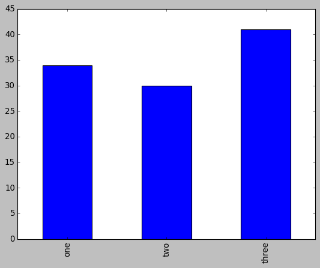


```python
# 用kind 来进行画图
dp.plot(kind='bar')
```


    <matplotlib.axes._subplots.AxesSubplot at 0x1a22f2cac8>


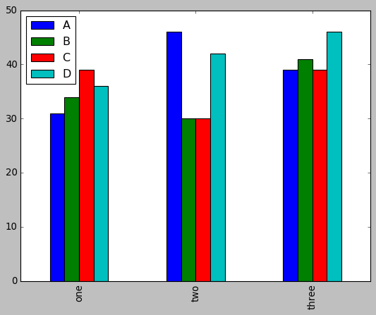


```python
# 进行累加
dp.plot(kind='bar',stacked=True)
```


    <matplotlib.axes._subplots.AxesSubplot at 0x1a2308c940>


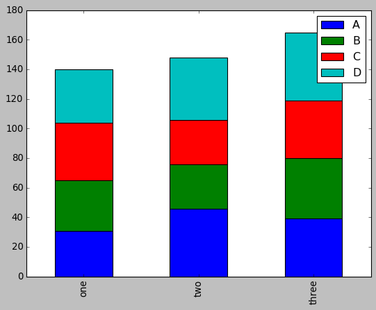


```python

# 直方图  figersize 图像大小 ，可以查看说明，进行具体项目的修改
dp.hist(figsize=(9,6))

```


    array([[<matplotlib.axes._subplots.AxesSubplot object at 0x1a23209208>,
            <matplotlib.axes._subplots.AxesSubplot object at 0x1a2322f828>],
           [<matplotlib.axes._subplots.AxesSubplot object at 0x1a23344da0>,
            <matplotlib.axes._subplots.AxesSubplot object at 0x1a23377358>]],
          dtype=object)


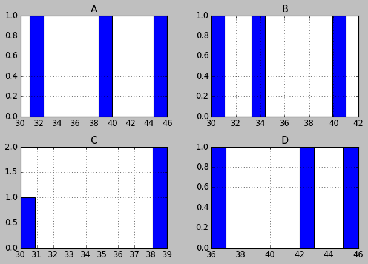


```python
# 密度图
dp.plot.kde()
```


    <matplotlib.axes._subplots.AxesSubplot at 0x1a234aa4a8>


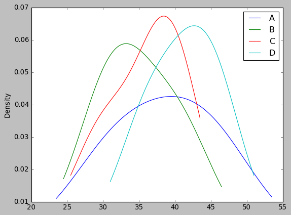

